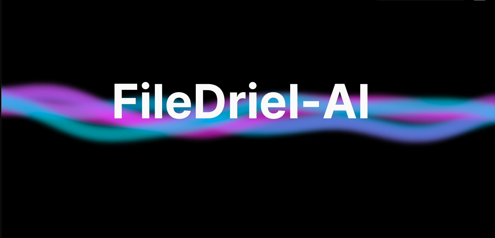
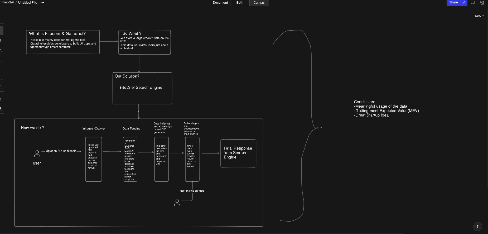

# FileDriel Search Engine

FileDriel is a decentralized search engine leveraging Filecoin and Galadriel to provide meaningful access to stored data on the IPFS network. This project aims to facilitate efficient data retrieval and utilization through blockchain technology.

## Overview

Filecoin is utilized for storing user-uploaded files securely on the IPFS (InterPlanetary File System). These files are crawled by an in-house crawler which extracts data into text or PDF formats.

### Process Flow

1. **File Storage on Filecoin**: Users upload files which are stored on Filecoin for secure and decentralized storage.

2. **Data Crawling**: An in-house crawler processes uploaded files, extracting relevant data in text or PDF format.

3. **Data Feeding to Galadriel**: Extracted data is fed into Galadriel's RAG (Retrieve, Aggregate, Generate) model. This model processes and stores the data in a database.

4. **Data Indexing and CID Generation**: A Python script indexes the processed data and generates Content IDs (CIDs) for efficient retrieval.

5. **Smart Contract Integration**: CIDs are embedded into smart contracts to enable on-chain queries. Users can query the blockchain for data stored on Filecoin via these smart contracts.

# Project Architecture Image

### Benefits

- **Meaningful Data Usage**: Enables meaningful utilization of stored data through efficient retrieval and query mechanisms.
  
- **Maximum Expected Value (MEV)**: Facilitates achieving the most expected value from stored data by leveraging blockchain for secure and transparent access.

## Getting Started

To begin using FileDriel Search Engine:

1. Ensure you have a Filecoin wallet set up for storing files securely.
2. Upload your files to Filecoin using the provided upload interface.
3. Wait for the data to be crawled and indexed by our system.
4. Start querying the indexed data via smart contracts embedded with CIDs.

## Future Enhancements

- Implementing advanced querying capabilities.
- Enhancing security measures for data storage and retrieval.
- Scaling the system to handle larger volumes of data and users.

## Conclusion

FileDriel Search Engine presents a novel approach to utilizing decentralized storage and AI-driven data retrieval. It combines the strengths of Filecoin for secure storage and Galadriel for intelligent data handling, promising a robust solution for decentralized search applications.